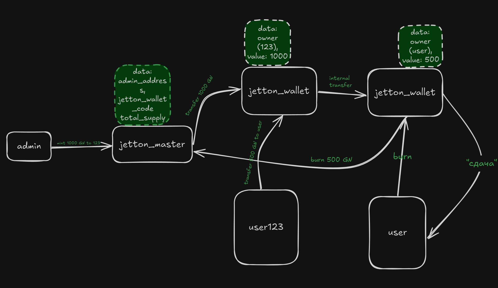

# 2-day

## Implementation of Jetton Wallet in the TON Blockchain

In the **TON** blockchain network, the goal was to implement a `jetton_wallet` that allows exchanging the admin's tokens for **TON**.

## Implementation Overview
- **The admin** mints (`LP`) tokens and sends them to `jetton_master`.
- `jetton_master` manages the created tokens and distributes them.
- `jetton_wallet` belongs to the user and holds the token balance.
- Tokens can be **transferred** between users.
- The burning mechanism has been implemented from ton/TEPS.

### Visual Diagram
A detailed description of the `jetton_wallet` structure and workflow can be found in the image below:

### Main Files:
- `sale.fc` – smart contract for exchanging tokens for TON.
- `deploySale.ts` – deployment script for the contract.
- `mintJetton.ts` – script for minting new tokens.
- `setJettonWallet.ts` – configuration script for setting up the wallet.

### How to Use
1. **Mint tokens** using `mintJetton.ts`.
2. **Deploy the sale contract** with `deploySale.ts`.
3. **Configure the wallet** using `setJettonWallet.ts`.
4. **Users can exchange their tokens for TON**.

